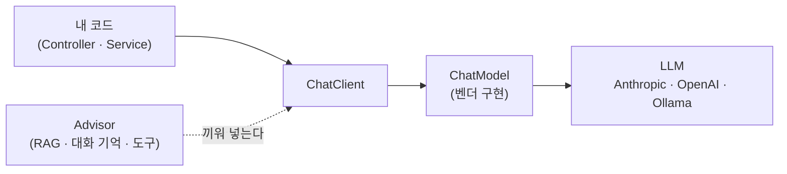
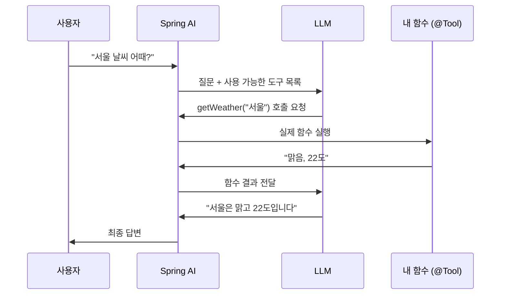
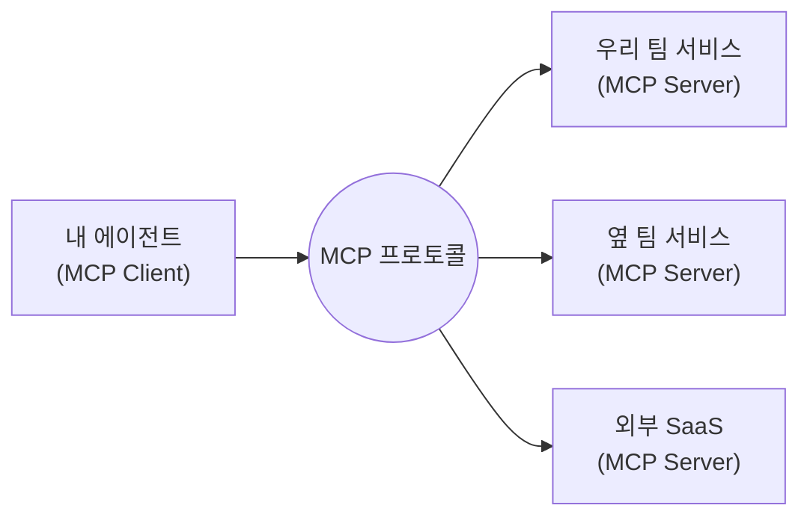
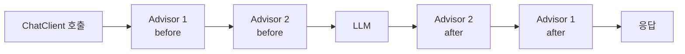

# Spring AI 2.0 — 개념부터 에이전트까지

> 팀 내 AI 스터디 학습 자료
> 대상: Java/Spring 백엔드 개발자 (Spring AI를 처음 접하는 사람 포함)
> 기준 버전: Spring AI 2.0.0 GA (2026-06-12 릴리스)

이 문서의 예제는 [`demo/`](demo/)에서 실제로 실행할 수 있습니다. `ANTHROPIC_API_KEY`만 있으면 되고(첫 기동만 임베딩 모델 다운로드로 네트워크 필요), 브라우저 화면에서 기능별로 눌러 확인합니다. 화면 각 섹션에 이 문서의 해당 장(§)이 표시되어 있습니다.

---

## 들어가며

### Spring AI란

**Java/Spring 생태계에서 AI 모델을 통합하는 표준 추상화입니다.** Python 진영의 LangChain에 대응합니다.

엔터프라이즈 백엔드는 여전히 Java/Spring 위에서 동작하고, Spring AI는 그 위에서 Spring 방식으로 AI를 통합합니다. 핵심 철학은 **이식성**입니다 — OpenAI든 Anthropic이든 로컬 Ollama든, 코드는 그대로 두고 의존성·설정만 바꿔 모델을 교체할 수 있습니다. `JdbcTemplate`이 DB 벤더를 추상화하던 발상과 같습니다.

### 1.x에서 2.0으로

- **1.0 (2025-05)** — 기본 추상화 등장: `ChatClient`, Structured Output, Tool Calling, RAG.
- **1.1 (2025-11)** — 안정화, Advisor 체계 정비.
- **2.0 (2026-06)** — Spring Boot 4로 토대를 다시 세운 릴리스. Tool Calling 정리, ToolSearch, MCP 편입.

이 문서는 **2.0만 기준으로** 설명합니다. 1.x를 몰라도 읽는 데 지장이 없고, 기존 코드를 올려야 하는 경우에 필요한 변경점은 마지막 "1.x → 2.0 한눈에" 절에 모아 두었습니다.

---

## 무엇을 만들 수 있나

| 유스케이스 | 설명 | 핵심 기능 |
| --- | --- | --- |
| **챗봇** | 대화 맥락을 기억하는 대화형 응답 | ChatClient + ChatMemory |
| **구조화 추출·분류** | 비정형 텍스트 → 타입 객체 (감정 분류, 필드 추출) | Structured Output |
| **사내 문서 Q&A (RAG)** | 회사 문서에 근거해 답하기 | RAG + VectorStore |
| **에이전트** | LLM이 실제 함수·시스템을 호출해 일을 처리 | Tool Calling |
| **도구·서비스 상호운용** | 외부/타 팀 도구를 표준 프로토콜로 연결 | MCP |

### 지원 범위

- **모델 종류** — Chat, Embedding, Text-to-Image, Audio Transcription, Text-to-Speech, Moderation.
- **벤더** — Anthropic, OpenAI, Amazon Bedrock, Google(Gemini/Vertex), Ollama, Mistral, DeepSeek 등.
- **VectorStore** — pgvector, Redis, Chroma, Qdrant, Elasticsearch, MongoDB Atlas 등 **21종**.
- **로컬 실행** — `spring-ai-starter-model-transformers`로 임베딩을 로컬 ONNX 모델에서 생성할 수 있습니다(외부 API 키 불필요). 데모의 RAG가 이 방식입니다.

---

## 큰 그림

새 이름이 여럿 나오지만, 지금 기억할 것은 **`ChatClient` 하나**입니다. 나머지는 그 주변에 어떻게 붙는지만 보면 됩니다.



**1. 내가 만지는 것은 `ChatClient` 하나입니다.** 이 문서의 모든 예제가 `chatClient.prompt()...`로 시작합니다.

**2. 벤더는 그 아래 `ChatModel`이 감춥니다.** 벤더를 바꾼다는 것은 이 구현체가 바뀐다는 뜻이고, 위의 호출 코드는 그대로입니다. 앞서 든 `JdbcTemplate` 비유가 여기입니다 — 인터페이스는 두고 드라이버만 갑니다.

**3. 기능은 `Advisor`로 끼워 넣습니다.** RAG도 대화 기억도 도구 호출도 전부 `ChatClient` 호출을 가로채는 Advisor입니다. 서블릿 필터나 `HandlerInterceptor`와 같은 자리라고 보면 됩니다.

이름은 지금 외우지 않아도 됩니다. §1부터 이 그림의 자리를 하나씩 채웁니다.

---

## 시작하기

**의존성 1개 + 설정 2줄이면 첫 호출을 할 수 있습니다.**

### 1. 의존성

```kotlin
implementation("org.springframework.ai:spring-ai-starter-model-anthropic")
```

### 2. 설정

```properties
spring.ai.anthropic.api-key=${ANTHROPIC_API_KEY}
spring.ai.anthropic.chat.model=claude-sonnet-4-5
```

### 3. 첫 호출

`ChatClient.Builder`가 자동으로 빈 등록됩니다. 이를 주입받아 사용합니다.

```kotlin
@RestController
class ChatController(builder: ChatClient.Builder) {
    private val chatClient = builder.build()

    @GetMapping("/ai")
    fun ai(@RequestParam message: String): String =
        chatClient.prompt()
            .user(message)
            .call()
            .content() ?: ""      // 2.0의 응답 메서드는 nullable
}
```

`prompt().user(...).call().content()` — 이 fluent 체인이 Spring AI의 심장입니다. `WebClient.Builder`를 주입받아 커스터마이징하던 패턴과 동일합니다.

### 벤더 바꾸기

여기까지가 전부입니다. 벤더를 바꿔도 **위 컨트롤러 코드는 한 글자도 손대지 않습니다** — 1번과 2번만 갈아 끼웁니다.

| 벤더 | 스타터 | 설정 |
| --- | --- | --- |
| Anthropic | `spring-ai-starter-model-anthropic` | `spring.ai.anthropic.api-key=...`<br>`spring.ai.anthropic.chat.model=claude-sonnet-4-5` |
| OpenAI | `spring-ai-starter-model-openai` | `spring.ai.openai.api-key=...`<br>`spring.ai.openai.chat.model=gpt-5` |
| Ollama | `spring-ai-starter-model-ollama` | `spring.ai.ollama.chat.model=llama3.2` |

Ollama만 API 키가 없습니다. 로컬에서 모델을 직접 돌리므로, 외부망이 막힌 환경의 선택지입니다.

---

## 핵심 기능 (2.0 기준 상세)

### 1. ChatClient — LLM 호출의 중심

**모든 LLM 호출이 통과하는 fluent API입니다.** 호출 방식·응답 형태·시스템 프롬프트를 여기서 다룹니다.

#### 응답 받는 세 가지 방법

시작하기에서 쓴 `.content()`가 셋 중 하나입니다. **무엇을 받을지에 따라 마지막 메서드만 바뀝니다.**

```kotlin
// 1) 텍스트 — 시작하기에서 쓴 것
val text: String? = chatClient.prompt().user(msg).call().content()

// 2) 전체 응답 — 토큰 사용량 등 메타데이터가 필요할 때 (§9)
val resp: ChatResponse? = chatClient.prompt().user(msg).call().chatResponse()
val tokens = resp?.metadata?.usage?.totalTokens

// 3) 타입 객체 — 바로 다음 §2에서 다룬다
val movie: Movie? = chatClient.prompt().user(msg).call().entity(Movie::class.java)
```

> `.call()` 자체는 모델을 호출하지 않습니다. `.content()` / `.chatResponse()` / `.entity()`를 호출하는 순간 실제 요청이 나갑니다.

**세 메서드 모두 nullable입니다.** 2.0이 JSpecify로 널 안전성을 API에 명시(`@Nullable`)한 결과이고, 널 처리는 호출부 책임입니다(`?: ""` 또는 `?: error(...)`).

#### 스트리밍

토큰이 오는 대로 흘려보내 첫 글자까지의 시간을 줄입니다(타이핑 효과). `.call()` 대신 `.stream()`을 쓰면 반환 타입이 `Flux`가 됩니다.

```kotlin
val flux: Flux<String> = chatClient.prompt().user(msg).stream().content()
```

이 `Flux`를 브라우저까지 내보내려면 컨트롤러에서 **SSE**(Server-Sent Events)로 반환합니다. `produces`를 지정하는 것이 핵심입니다.

```kotlin
@GetMapping("/stream", produces = [MediaType.TEXT_EVENT_STREAM_VALUE])
fun stream(@RequestParam message: String): Flux<String> =
    chatClient.prompt().user(message).stream().content()
```

- **WebFlux가 필수는 아닙니다.** Spring MVC도 리액티브 반환 타입을 처리하므로 `spring-boot-starter-web`만으로 동작합니다.
- 브라우저 쪽은 `EventSource`로 받습니다.

> 스트리밍에는 제약이 따릅니다. `.entity()`(Structured Output)처럼 응답 전체가 모여야 성립하는 기능은 함께 쓸 수 없고, 토큰 사용량 같은 메타데이터도 스트림이 끝나야 확정됩니다.

#### 시스템 프롬프트 (페르소나)

호출 시점에 `.system()`으로 페르소나를 지정합니다. 빌더의 `defaultSystem()`에 기본값을 두고 호출마다 덮어쓸 수도 있습니다.

```kotlin
chatClient.prompt()
    .system("너는 해적처럼 말하는 챗봇이다. 항상 해적 말투로 답하라.")
    .user(message)
    .call()
    .content()
```

### 2. Structured Output — 응답을 타입 객체로

**`.content()` 대신 `.entity()` 한 줄로, LLM 응답을 타입 객체로 받습니다.** LLM을 타입 안전한 함수처럼 쓰는 것입니다.

```kotlin
data class Movie(val title: String, val year: Int, val director: String)

val movie: Movie = chatClient.prompt()
    .user("SF 영화 하나 추천해줘")
    .call()
    .entity(Movie::class.java)
    ?: error("Failed to convert model response to Movie")
```

- 내부 동작: data class로 **스키마 자동 생성 → 프롬프트에 주입 → LLM이 JSON 응답 → `BeanOutputConverter`가 역직렬화**.
- 컬렉션은 `entity(object : ParameterizedTypeReference<List<Movie>>() {})`로 받습니다.
- `.entity()` 자체는 재시도하지 않습니다. 재시도는 `StructuredOutputValidationAdvisor`가 별도로 담당합니다.

> **LLM 출력을 신뢰하지 말고 외부 입력처럼 다룹니다.** 객체로 받았어도 값 검증(범위·필수값)은 애플리케이션의 책임입니다.

### 3. 대화 메모리 (ChatMemory) — 맥락을 기억하기

**LLM은 기본적으로 이전 대화를 기억하지 못합니다.** 매 호출이 독립적입니다. 대화형 챗봇을 만들려면 이전 메시지를 다시 넣어줘야 합니다. `ChatMemory` + `MessageChatMemoryAdvisor`가 이를 자동화합니다.

```kotlin
// builder: ChatClient.Builder, chatMemory: ChatMemory 를 주입받는다
val chatClient = builder
    .defaultAdvisors(MessageChatMemoryAdvisor.builder(chatMemory).build())
    .build()

// 호출 시 대화 ID를 넘긴다 (세션 구분)
chatClient.prompt()
    .user("방금 뭐라고 했지?")
    .advisors { it.param(ChatMemory.CONVERSATION_ID, "user-42") }
    .call()
    .content()
```

> 대화 ID는 **호출 시점에** 넘겨야 합니다. 빌더에 미리 박아둘 수 없고, 누락하면 예외가 납니다.

#### 대화를 어디에 저장할 것인가

위 예제의 `MessageWindowChatMemory`는 기본적으로 **메모리에만** 담습니다. 서버를 재시작하면 대화가 사라지고, 인스턴스를 2대로 늘리면 어느 서버로 붙느냐에 따라 맥락이 갈립니다. 운영에서는 저장소를 붙여야 합니다.

역할이 둘로 나뉘어 있습니다.

- **`ChatMemory`** — 무엇을 기억할지 정하는 **정책** (예: 최근 N개 메시지만 유지)
- **`ChatMemoryRepository`** — 그것을 어디에 둘지 정하는 **저장소** (JDBC, Redis, MongoDB, Cassandra, Neo4j)

```kotlin
@Bean
fun chatMemory(chatMemoryRepository: ChatMemoryRepository): ChatMemory =
    MessageWindowChatMemory.builder()
        .chatMemoryRepository(chatMemoryRepository)   // 저장소만 갈아 끼운다
        .build()
```

저장소는 스타터로 선택합니다. 스타터와 설정만 바꾸면 되고 **위 코드는 그대로**입니다.

```kotlin
implementation("org.springframework.ai:spring-ai-starter-model-chat-memory-repository-jdbc")
```

```properties
spring.datasource.url=jdbc:postgresql://localhost:5432/app
spring.ai.chat.memory.repository.jdbc.initialize-schema=always
```

JDBC 저장소는 플랫폼별 스키마(postgresql, mysql, mariadb, oracle, sqlserver, h2 등)를 내장하고 있고, `initialize-schema` 같은 **기존 Boot의 스키마 초기화 방식을 그대로** 씁니다. 애플리케이션의 `DataSource`를 공유하는 구조입니다.

> 데모 앱은 설치 없이 실행되도록 같은 JDBC 저장소를 H2 파일 모드(`jdbc:h2:file:./data/chatmemory`)로 씁니다. 앱을 재시작해도 대화가 유지되는 것을 확인할 수 있습니다.

### 4. Tool Calling — LLM이 함수를 호출한다

이름은 "LLM이 호출한다"지만, 실행하는 것은 우리 앱입니다. **LLM은 말만 할 수 있습니다** — "이 함수를 이 인자로 불러 달라"고.



#### 왜 두 번 부르나

말만 할 수 있으니 한 번으로 안 끝납니다. LLM이 `getWeather("서울")`을 불러 달라고 말하고(1차), 앱이 실행해 `"맑음, 22도"`를 얻고, 그걸 다시 줘야 `"서울은 맑고 22도입니다"`라는 문장이 나옵니다(2차).

> 도구를 한 번 쓰는 데 LLM 호출이 2회입니다. 연달아 쓰면 그만큼 더 늘고, 매번 대화 전체가 다시 올라갑니다(§9).

도구는 `@Tool` 애노테이션 하나로 정의합니다. `description`이 LLM에게 "언제 이 도구를 쓸지" 알려주는 힌트라 가장 중요합니다.

```kotlin
class WeatherTools {
    @Tool(description = "특정 도시의 현재 날씨를 조회한다")
    fun getWeather(@ToolParam(description = "도시 이름") city: String): String {
        // 실제 조회 로직 (DB, 외부 API 등)
        return "$city: 맑음, 22도"
    }
}

chatClient.prompt()
    .user("서울 날씨 어때?")
    .tools(WeatherTools())   // @Tool 메서드를 가진 객체를 넘긴다
    .call()
    .content()
```

이 두 번의 왕복을 돌리는 것이 `ToolCallingAdvisor`입니다. `.tools()`를 넘기면 자동으로 등록되므로 따로 할 일은 없습니다.

중요한 것은 **이 루프가 Advisor 체인 안에서 돈다**는 점입니다(큰 그림에서 필터에 빗댄 그 자리). 도구 실행 앞뒤에 다른 Advisor를 끼워 넣어 로깅·권한 확인·마스킹 같은 것을 걸 수 있고, 만드는 방법은 §8에서 다룹니다.

체인은 **재진입**도 지원합니다. Advisor가 하위 체인으로 다시 들어갈 수 있어서, 도구 호출 루프·Structured Output 재시도(`StructuredOutputValidationAdvisor`)·평가 루프가 모두 이 하나의 메커니즘 위에서 돕니다.

> **제어의 역전(IoC).** 기존 백엔드는 개발자가 모든 분기를 작성했습니다(`if A else B`). Tool Calling은 "도구를 제공할 테니 목표를 달성하라"고 **위임**하는 방식입니다. LLM이 오케스트레이터가 되고, 개발자는 검증된 도구만 제공합니다. 이것이 **에이전트의 본질**입니다.

### 5. RAG — 회사 내부 문서에 근거해 답하기

**LLM은 특정 조직의 내부 문서를 알지 못합니다.** 내부 정책을 물으면 사실과 다른 내용을 생성합니다(할루시네이션). RAG는 답하기 전에 관련 문서를 검색해 프롬프트에 끼워 넣는 방식으로, 모델은 그대로 두고 지식만 주입합니다.

- **Retrieve(검색)** — 질문과 의미가 가까운 문서를 `VectorStore`에서 찾습니다.
- **Augment(증강)** — 찾은 문서를 질문과 함께 프롬프트에 붙입니다.
- **Generate(생성)** — LLM이 그 문서를 근거로 답합니다.

Spring AI에서는 `QuestionAnswerAdvisor` 하나만 붙이면 이 흐름이 자동으로 돌아갑니다.

```kotlin
chatClient.prompt()
    .advisors(QuestionAnswerAdvisor.builder(vectorStore).build())  // 이 한 줄이 RAG
    .user("우리 환불 정책이 뭐야?")
    .call()
    .content()
```

증강(Augment)의 실체는 **검색한 문서를 프롬프트 텍스트에 붙이는 것**입니다. LLM이 실제로 받는 프롬프트는 이렇게 바뀝니다.

```
아래 컨텍스트를 근거로 답하라.
[컨텍스트: "환불은 구매 후 7일 이내… 디지털 상품은 제외…"]
[질문] 우리 환불 정책이 뭐야?
```

#### VectorStore — 검색을 담당하는 부품

`VectorStore`는 문서를 **임베딩(의미를 담은 벡터)** 으로 저장하고 유사도로 검색하는 **공통 인터페이스**입니다.

```kotlin
vectorStore.add(documents)                    // 문서 저장 (임베딩 자동 생성)
vectorStore.similaritySearch("환불 정책")       // 의미가 가까운 문서 top-N 검색
```

실제 저장소(pgvector, Redis, Chroma 등)는 구현체를 갈아 끼우는 식이라, 어느 것을 쓰든 앱 코드는 그대로입니다. 스타터만 추가하면 됩니다(`spring-ai-starter-vector-store-pgvector` 등).

#### 임베딩 모델 — 기본값은 어디서 오나

`vectorStore.add(documents)`가 임베딩을 "자동 생성"한다고 했는데, 그 벡터를 만드는 모델은 무엇일까요? **Spring AI에 전역 기본 임베딩 모델이 따로 있는 게 아니라, 클래스패스에 올라온 model 스타터가 정합니다.**

데모는 `spring-ai-starter-model-transformers`를 넣어 `TransformersEmbeddingModel`(기본 모델 `all-MiniLM-L6-v2`)을 자동 구성합니다. ONNX 모델을 앱 안에서 직접 돌리므로 **Anthropic 외 추가 API 키가 필요 없고**, 첫 기동에만 모델을 내려받아 로컬에 캐시합니다. 모델·캐시 위치는 `spring.ai.embedding.transformer.*`로 바꿉니다.

> **RAG = 모델 재학습 없이 지식만 실시간 주입.** 파인튜닝보다 싸고 빠르며, 문서가 바뀌면 DB만 갱신하면 됩니다.

### 6. ToolSearch — 도구가 수백 개일 때 (2.0 신규)

**도구가 수백 개여도, 질문에 맞는 것만 골라 노출합니다.** 도구를 전부 프롬프트에 넣으면 토큰이 커지고 LLM의 선택 정확도가 떨어집니다. 2.0의 `ToolSearchToolCallingAdvisor`는 이 문제를 점진적 노출(progressive tool disclosure)로 풉니다.

Advisor를 직접 구성해 필요한 호출에만 붙입니다. 부품 두 개만 주면 됩니다 — **도구를 어떻게 찾을지**(`ToolIndex`: 정규식·Lucene·벡터 중 택1)와 **찾은 도구를 실행할 것**(`ToolCallingManager`, §4에서 본 그 실행 루프).

```kotlin
private val toolSearchAdvisor = ToolSearchToolCallingAdvisor.builder()
    .toolIndex(RegexToolIndex())                     // regex / lucene / vector
    .toolCallingManager(ToolCallingManager.builder().build())
    .build()

chatClient.prompt()
    .advisors(toolSearchAdvisor)
    // 세션별 도구 인덱스를 캐시하므로 세션 ID가 필요하다
    .advisors { it.param(ChatMemory.CONVERSATION_ID, "toolsearch-demo") }
    .tools(ManyTools())
    .user("사용자 준의 최근 주문 상태 알려줘")
    .call()
    .content()
```

RAG가 문서를 검색해 주입하듯, 도구를 검색해 주입하는 셈입니다.

`spring.ai.chat.client.tool-search-advisor.enabled=true` 프로퍼티로 자동 구성하는 경로도 있지만, 2.0.0 기준으로 적용 범위가 전역이고 starter가 BOM에 없는 등 제약이 있어 이 문서는 수동 구성을 권합니다.

### 7. MCP — 도구의 상호운용 표준 (2.0 핵심)

**애플리케이션 밖에 흩어진 도구까지 표준 프로토콜로 연결합니다.**

앞에서 다룬 도구는 모두 애플리케이션 내부 함수였습니다. 실제 도구는 여러 곳에 흩어져 있습니다(자체 서비스, 다른 팀 서비스, 외부 SaaS). MCP(Model Context Protocol)는 도구·리소스·프롬프트를 노출하는 표준 프로토콜로, 규격만 맞추면 제공자·소비자가 서로의 구현을 몰라도 연결됩니다.



Spring AI 2.0은 MCP를 1급으로 지원합니다.

- **서버 애노테이션** — `@McpTool` / `@McpResource` / `@McpPrompt` / `@McpComplete`. `@Tool`처럼 선언만 하면 함수가 MCP 서버로 노출되고, JSON 스키마는 자동 생성됩니다.
- **클라이언트** — 다른 곳에서 만든 MCP 서버를 내 에이전트의 도구로 가져다 씁니다.
- **전송 내장** — WebMVC/WebFlux 전송이 Spring AI에 들어 있어 별도 SDK 의존성이 필요 없습니다. 기본 전송은 Streamable HTTP이고, 로컬 프로세스끼리 붙일 때 쓰는 STDIO도 그대로 있습니다.

```kotlin
@Component
class CalculatorTools {
    @McpTool(name = "add", description = "두 수를 더한다")
    fun add(
        @McpToolParam(description = "첫 번째 수") a: Int,
        @McpToolParam(description = "두 번째 수") b: Int,
    ): Int = a + b
}
```

> 지금까지 이야기한 이식성은 "벤더를 바꿔도 코드 유지"였습니다. MCP는 이식성을 **"도구와 에이전트가 벤더·언어를 넘어 연결된다"** 로 확장합니다. 한 서비스가 다른 에이전트의 도구가 되고, 반대로 다른 도구가 그 에이전트의 수단이 됩니다.

### 8. Advisor 직접 만들기

**RAG, 대화 메모리, ToolSearch는 모두 Advisor였습니다.** `QuestionAnswerAdvisor`, `MessageChatMemoryAdvisor`, `ToolSearchToolCallingAdvisor` — 앞에서 `.advisors(...)`로 붙인 것들이 전부 같은 확장점입니다. 직접 만들 수도 있습니다.

큰 그림에서 서블릿 필터에 빗댄 그 자리입니다. Advisor는 `ChatClient` 호출을 가로채는 체인이고, 요청이 모델로 나가기 전과 응답이 돌아온 후에 개입합니다.



`BaseAdvisor`를 구현하면 `before`/`after` 두 개만 채우면 됩니다.

```kotlin
// CARD_NUMBER(정규식) · MASKED_PROMPT(컨텍스트 키) 상수 정의는 생략. 전체는 demo/ 참고
class PiiMaskingAdvisor(private val order: Int = 0) : BaseAdvisor {

    // 모델로 나가기 전 — 카드번호를 마스킹한다
    override fun before(request: ChatClientRequest, chain: AdvisorChain): ChatClientRequest {
        val original = request.prompt().userMessage.text ?: return request
        val masked = CARD_NUMBER.replace(original, "****-****-****-****")
        if (masked == original) return request

        return request.mutate()
            .prompt(request.prompt().augmentUserMessage { it.mutate().text(masked).build() })
            .context(MASKED_PROMPT, masked)   // 호출부가 확인할 수 있게 기록
            .build()
    }

    // 모델에서 돌아온 후 — 여기선 통과
    override fun after(response: ChatClientResponse, chain: AdvisorChain) = response

    override fun getOrder(): Int = order
}
```

```kotlin
chatClient.prompt()
    .advisors(PiiMaskingAdvisor(order = 0), SimpleLoggerAdvisor.builder().build())
    .user(message)
    .call()
    .chatClientResponse()
```

- **실행 순서** — `getOrder()`가 작은 쪽이 먼저 `before`를 실행합니다. `after`는 역순입니다.
- **컨텍스트** — `ChatClientRequest`/`ChatClientResponse`는 `context` 맵을 함께 나릅니다. Advisor가 남긴 값을 호출부에서 `chatClientResponse().context()`로 읽을 수 있습니다.
- **기본 제공** — `SimpleLoggerAdvisor`는 요청·응답을 로그로 남깁니다(DEBUG). 별도 구현 없이 붙이기만 하면 됩니다.

이 확장점이 있는 덕분에, 감사 로그·마스킹·비용 측정·금칙어 필터 같은 **횡단 관심사를 비즈니스 코드 밖에서** 처리할 수 있습니다. 문서 마지막에서 이야기하는 "가드레일"이 실제로 구현되는 자리이기도 합니다.

### 9. 관측성

**LLM은 토큰 단위로 과금됩니다.** 호출 한 번의 비용이 입력·출력 길이에 따라 달라지므로, 사용량 추적은 선택이 아니라 운영 요건입니다.

읽는 방법은 두 가지입니다. 호출 단위로 직접 읽거나, Micrometer 지표로 모으거나.

#### 호출 단위로 읽기

토큰 사용량은 `.content()` 대신 `.chatResponse()`로 받아 메타데이터에서 읽습니다.

```kotlin
val response = chatClient.prompt().user(msg).call().chatResponse()
    ?: error("Model returned no response")

val usage = response.metadata.usage
usage.promptTokens                // 입력 토큰
usage.completionTokens            // 출력 토큰
usage.totalTokens                 // 합계
usage.cacheReadInputTokens        // 캐시로 읽은 토큰 (2.0 통합 지표)
```

캐시 토큰처럼 벤더마다 이름이 다르던 지표도 `Usage` 인터페이스가 흡수합니다. 벤더가 바뀌어도 위 코드는 그대로입니다.

#### 지표로 모으기

`ChatObservationAutoConfiguration`이 Micrometer Observation을 자동 구성합니다. `MeterRegistry` 빈이 있으면(actuator를 넣으면) `ChatModelMeterObservationHandler`가 호출별 토큰 사용량과 소요 시간을 지표로 기록하므로, 대시보드·알림은 기존 Micrometer 파이프라인을 그대로 씁니다.

프롬프트와 응답 본문은 기본적으로 로그에 남지 않습니다. 필요할 때만 켭니다.

```properties
spring.ai.chat.observations.log-prompt=true       # 기본 false
spring.ai.chat.observations.log-completion=true   # 기본 false
```

켜면 `ChatModelPromptContentObservationHandler`가 모델에 나간 프롬프트 전문을 INFO로 찍습니다. RAG가 끼워넣은 검색 문서, 메모리가 붙인 과거 대화가 여기서 그대로 보이므로 데모·디버깅에 특히 유용합니다. 데모 앱은 actuator와 함께 이 두 옵션을 켜 둡니다.

> **actuator가 전제입니다.** 없이 프로퍼티만 켜면 NOOP registry로 폴백해, 오류 없이 조용히 아무것도 찍히지 않습니다.

> 프롬프트·응답 전문에는 개인정보나 사내 문서가 그대로 남을 수 있으므로 운영 환경에서는 신중해야 합니다. 기본값이 `false`인 이유이기도 합니다.

---

## 직접 만들어 보기 — 사내 문서 Q&A 에이전트

앞의 기능들을 하나의 `ChatClient`에 결합한 예시입니다. RAG(사내 문서), 대화 메모리, 실제 조회 도구(Tool)를 함께 얹으면 에이전트가 됩니다.

```kotlin
@Bean
fun supportAgent(
    builder: ChatClient.Builder,
    vectorStore: VectorStore,
    chatMemory: ChatMemory,
): ChatClient =
    builder
        .defaultSystem("너는 사내 고객지원 상담원이다. 문서에 근거해 답하라.")
        .defaultAdvisors(
            QuestionAnswerAdvisor.builder(vectorStore).build(),      // RAG: 사내 문서 근거
            MessageChatMemoryAdvisor.builder(chatMemory).build(),    // 대화 맥락 유지
        )
        .defaultTools(OrderTools())                                  // 실제 주문 조회 도구
        .build()
```

이 하나의 에이전트가 이렇게 동작합니다.

1. 사용자가 "지난주 주문 환불돼요?"라고 묻는다.
2. **RAG** — 환불 정책 문서를 검색해 근거로 붙인다.
3. **Tool** — LLM이 `getOrder(userId)`를 호출해 실제 주문 상태를 조회한다.
4. **Memory** — 이전 대화("지난주 주문"이 무엇인지)를 기억한다.
5. 정책 + 실제 데이터에 근거한 답을 만든다.

개발자가 만드는 것은 검증된 도구와 신뢰할 수 있는 지식이고, 그것들을 언제 어떻게 조합할지는 LLM이 정합니다.

---

## 1.x → 2.0 한눈에

| 영역           | 1.x                | 2.0                                         |
| ------------ | ------------------ | ------------------------------------------- |
| 런타임          | Spring Boot 3      | **Spring Boot 4 / Framework 7 / Jackson 3** |
| 널 안전성        | 명시 없음              | **JSpecify `@Nullable`** (Kotlin에서 `String?`로 드러남) |
| Tool Calling | 실행 루프가 모델 구현 내부<br>(`internalToolExecutionEnabled`) | `ToolCallingAdvisor`로 분리, Advisor 체인에 편입 (자동 등록) |
| 대규모 도구       | —                  | **ToolSearch** (점진적 노출)                     |
| MCP          | SDK 별도             | **Spring AI 1급 편입** (`@McpTool`, 전송 내장)     |
| 대화 메모리       | 빌더에 conversationId | 호출 시점 `CONVERSATION_ID` 필수                  |
| 토큰·캐시 지표     | 벤더별 제각각            | 통합 `Usage` API                              |
| 벤더           | 변형 다수              | 정리 (예: OpenAI 3종 → 1종)                      |

### 그래서 2.0은 "에이전트 프레임워크"인가

에이전트라는 말이 자주 나오지만, 코어에는 `Agent`라는 이름의 무언가가 없습니다. BOM 2.0.0의 아티팩트 164개 중 이름에 `agent`가 들어간 것은 하나도 없고, 발표문이 소개하는 에이전트 도구들(`spring-ai-agent-utils`, `spring-ai-session`)은 모두 코어 밖 커뮤니티 프로젝트입니다.

> "You could call tools; you could not build on top of tool calling." — [Spring AI 2.0.0 GA 발표](https://spring.io/blog/2026/06/12/spring-ai-2-0-0-GA-available-now)

1.x는 도구 실행 루프가 각 모델 구현 안에 숨어 있었습니다(§4). 2.0은 그 루프를 Advisor 체인으로 꺼냈고, 체인이 재진입을 지원하면서 ToolSearch(§6)와 커스텀 Advisor(§8)가 같은 자리에 얹힙니다.

**바로 앞에서 만든 사내 문서 Q&A 에이전트가 그 결과물입니다** — 프레임워크가 준 것은 조립할 자리이고, 에이전트는 우리가 만들었습니다.

---

## 정리 — 백엔드 개발자의 역할

AI를 도입하면 백엔드 개발자의 역할이 바뀝니다. 더 이상 모든 분기를 직접 작성하지 않습니다.

- **검증된 도구를 만든다** — LLM이 호출할 안전한 함수(`@Tool`), 필요하면 `@McpTool`로 표준 노출까지.
- **지식을 공급한다** — RAG로 신뢰할 수 있는 데이터를 주입.
- **가드레일을 친다** — 위험 작업은 도구로 만들지 않거나, 노출을 통제(ToolSearch)하거나, 사람 승인(human-in-the-loop)을 끼운다.
- **출력을 검증한다** — LLM 출력을 외부 입력처럼 다룬다.

무게중심이 **"흐름을 직접 제어"에서 "위임하되 통제"로** 이동합니다. LLM이 오케스트레이터라면, 백엔드는 그것이 안전하게 동작할 **범위와 규칙**을 정의합니다.

**관통하는 두 테마**

- **이식성** — 벤더/DB 교체를 넘어, 이제 도구·에이전트의 상호운용(MCP)까지.
- **위임 vs 통제** — LLM에 얼마나 맡기고, 어디에 가드레일을 칠 것인가. 에이전트가 커질수록 이 질문이 더 중요해집니다.

---

## 참고

- Spring AI Reference (2.0): https://docs.spring.io/spring-ai/reference/2.0/
- Spring AI 2.0 업그레이드 노트: https://docs.spring.io/spring-ai/reference/upgrade-notes.html#upgrading-to-2-0-0
- Spring AI 2.0.0 GA 블로그: https://spring.io/blog/2026/06/12/spring-ai-2-0-0-GA-available-now
- Spring AI 1.0 GA 블로그: https://spring.io/blog/2025/05/20/spring-ai-1-0-GA-released/
- Spring AI 1.1 GA 블로그: https://spring.io/blog/2025/11/12/spring-ai-1-1-GA-released/
- 임베딩 모델 `all-MiniLM-L6-v2`: https://huggingface.co/sentence-transformers/all-MiniLM-L6-v2
- 이 자료의 예제는 Anthropic 스타터에 `claude-sonnet-4-5`를 지정해 사용합니다.
