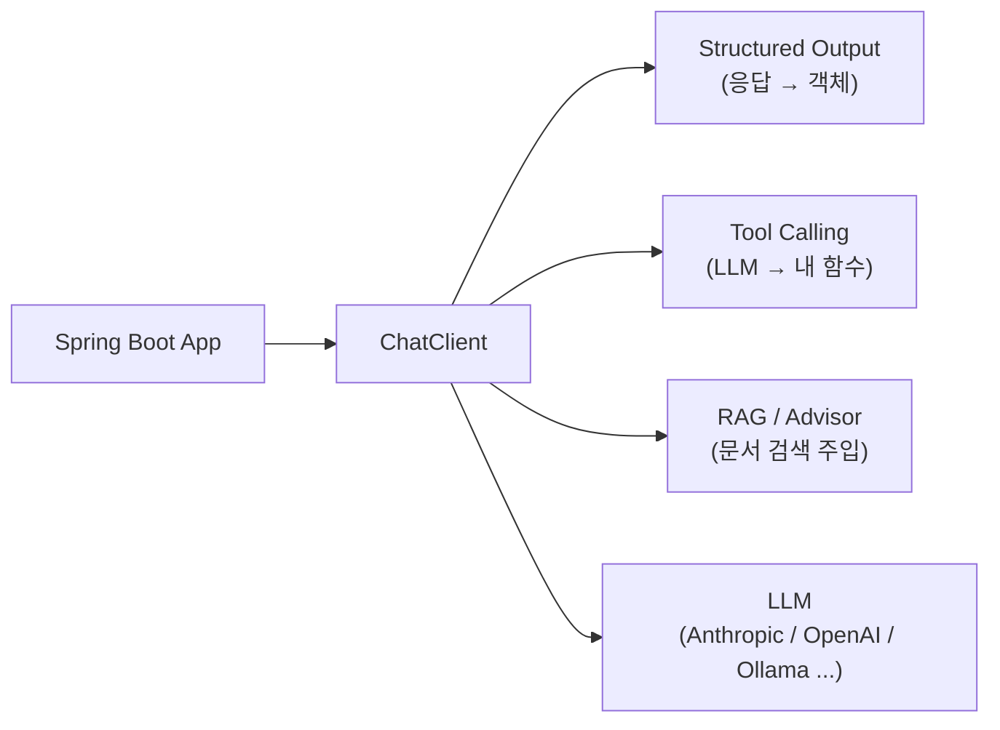
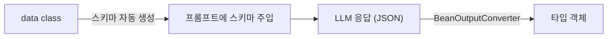
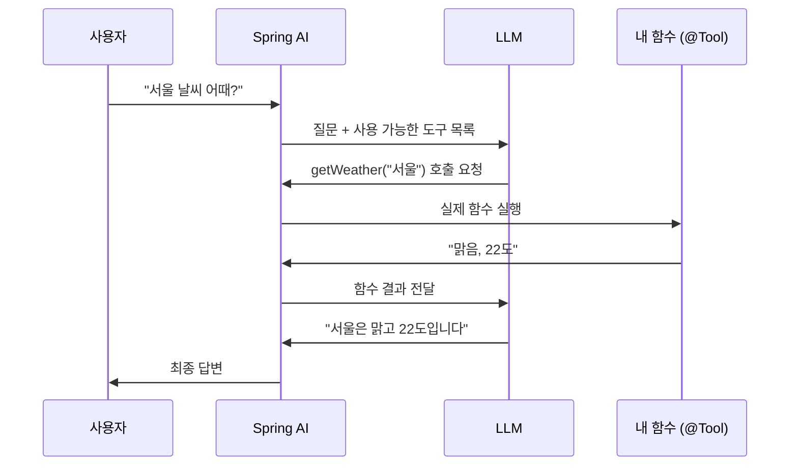
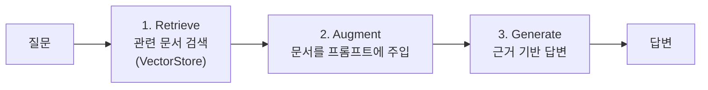

# Spring AI 톺아보기

> 팀 내 AI 스터디 발표 자료 (약 20분 + 라이브 데모)
> 대상: 시니어 백엔드 개발자
> 기준 버전: Spring AI 1.1.x (현행 GA, 최신 패치 1.1.8 / 2026-06)

---

## 들어가며

LLM이 나온 뒤 AI 애플리케이션 개발 생태계는 대부분 Python으로 쏠렸다. LangChain, LlamaIndex 같은 도구들이 그 중심에 있다. 하지만 현실의 엔터프라이즈 백엔드는 여전히 Java/Spring 위에서 돌아간다.

**Spring AI는 "Java/Spring 진영의 LangChain"** 이다. Spring 생태계 안에서, Spring답게 AI를 붙일 수 있게 해준다.

이 문서는 시니어 백엔드가 실제로 던질 법한 질문 6개를 따라가며 Spring AI의 핵심을 정리한다. 코드는 최소한만 싣고, 실제 동작은 라이브 데모로 확인한다.

관통하는 테마 두 가지를 미리 던져둔다.

- **이식성(Portability)** — 벤더나 DB를 바꿔도 코드는 유지된다. `JdbcTemplate`이 DB 벤더를 추상화하던 그 발상.
- **위임 vs 통제** — LLM에 흐름을 얼마나 맡기고, 어디에 가드레일을 칠 것인가.

---

## 큰 그림



`ChatClient` 하나가 모든 것의 중심이다. 나머지는 그 위에 얹히는 기능이다.

---

## Q1. Spring AI는 왜 나왔나?

한 마디로 **"Java/Spring 진영에도 LangChain 같은 게 필요했다."**

LLM 등장 이후 AI 앱 생태계는 Python으로 쏠렸다. 하지만 엔터프라이즈 백엔드는 여전히 Java/Spring이다. 이 회사들이 AI를 붙이려면 선택지가 둘뿐이었다.

- Python 서비스를 따로 띄워 통신하거나
- OpenAI/Anthropic SDK를 raw하게 직접 호출하거나

둘 다 불편했다. 그래서 Spring 팀이 "우리 생태계 안에서, Spring답게 AI를 붙이게 하자"며 만든 것이 Spring AI다.

핵심 철학은 **이식성 + 추상화**. OpenAI든 Anthropic이든 로컬 Ollama든, **코드는 그대로 두고 의존성·설정만 바꿔** 모델을 갈아끼울 수 있다.

---

## Q2. 그냥 Anthropic SDK를 직접 쓰면?

물론 가능. 다만 코드가 특정 벤더에 종속되고, JSON 파싱·재시도·툴 호출 루프 같은 반복 작업을 직접 구현해야 한다. Spring AI는 이를 표준 추상화로 제공한다.

> `JdbcTemplate`이 DB 벤더를 추상화하듯, `ChatClient`가 LLM 벤더를 추상화할 수 있다.

Spring AI가 대신 처리해주는 반복 작업들:

| 영역 | 직접 구현 시 | Spring AI |
| --- | --- | --- |
| 모델 교체 | 벤더 SDK에 종속 | 설정만 변경 |
| 구조화 출력 | JSON 파싱·검증·재시도 직접 | `.entity()` 한 줄 |
| Tool Calling | 함수 스키마·호출 라우팅 직접 | `@Tool` 어노테이션 |
| RAG / 메모리 / 관측성 | 전부 직접 | 벡터스토어 추상화, Advisor, Micrometer 연동 |

즉 가치는 **"추상화 그 자체"가 아니라, AI 앱에서 반복되는 귀찮은 일을 Spring 방식으로 처리해준다**는 점에 있다.

### 셋업은 얼마나 간단한가

의존성 1개 + 설정 2줄이면 끝난다.

```groovy
implementation("org.springframework.ai:spring-ai-starter-model-anthropic")
```

```properties
spring.ai.anthropic.api-key=${ANTHROPIC_API_KEY}
spring.ai.anthropic.chat.options.model=claude-sonnet-4-5
```

이러면 `ChatClient.Builder`가 자동으로 빈 등록된다. 주입받아 쓰면 된다.

```kotlin
chatClient.prompt()   // 프롬프트 시작
    .user(message)    // 유저 메시지
    .call()           // 동기 호출 (.stream() 이면 SSE 스트리밍)
    .content()         // 응답 텍스트
```

`prompt().user(...).call().content()` — 이 fluent 체인이 Spring AI의 심장이다. `WebClient.Builder`를 주입받아 커스터마이징하던 패턴과 동일하다.

> 시스템 프롬프트(페르소나)는 빌더의 `defaultSystem()`에 박아두고, 호출 시점 `.system()`으로 덮어쓴다. `WebClient`의 `defaultHeader()`와 같은 계층 구조.

> **📺 라이브 데모** — 기본 채팅 호출, 그리고 `.stream()`으로 토큰 스트리밍(타이핑 효과)

---

## Q3. LLM 응답을 어떻게 객체로 받나?

LLM 응답은 결국 그냥 텍스트(String)다. 하지만 백엔드가 원하는 건 타입 있는 객체다. 보통이면 이 과정을 직접 짜야 한다.

> 프롬프트에 "JSON으로 답해" → 응답 받기 → 마크다운 백틱 제거 → `ObjectMapper` 파싱 → 깨지면 재시도

Spring AI는 이걸 **`.entity()` 한 줄**로 처리한다.

```kotlin
data class Movie(val title: String, val year: Int, val director: String)

val movie: Movie = chatClient.prompt()
    .user("SF 장르 영화 하나 추천해줘")
    .call()
    .entity(Movie::class.java)   // .content() 대신 .entity()
```

내부 동작 3단계:



이것의 의미는 **"LLM을 타입 안전한 함수처럼 쓴다"** 는 것. 비정형 텍스트 입력 → 정형 객체 출력. DTO 변환 레이어가 LLM으로 바뀐 셈.

### LLM이 스키마를 안 지키면?

가끔 깨질 수 있다. 현실적인 방어선:

1. **최신 모델은 잘 안 깨진다** — 최신 프론티어 모델은 스키마를 거의 정확히 지킨다.
2. **강제 JSON 모드 / Tool Calling** — 일부 프로바이더는 특정 스키마만 출력하도록 강제할 수 있다.
3. **재시도 Advisor** — 파싱 실패 시 "형식이 틀렸다, 다시 하라"고 LLM에 되던진다.
4. **검증은 여전히 우리 책임** — `.entity()`로 객체를 받았어도 비즈니스 검증(값 범위 등)은 평소처럼 한다.

> **LLM 출력을 신뢰하지 말고, 외부 입력처럼 다뤄라.**
> Structured Output은 마법이 아니라 *스키마 주입 + 파싱 + 재시도*의 자동화다. 검증 책임은 여전히 우리에게 있다.

> **📺 라이브 데모** — 같은 프롬프트를 `.content()` vs `.entity()`로 받아 비교

---

## Q4. LLM이 내 코드를 실행한다고?

LLM은 기본적으로 학습 데이터 안에 갇혀 있다. 오늘 날씨도, 우리 DB의 주문 내역도 모른다. **Tool Calling**은 여기에 "필요하면 이 함수들을 갖다 쓰라"며 도구를 쥐여주는 것이다.



코드는 `@Tool` 어노테이션 하나다. 함수 스키마 생성, 호출 라우팅, 결과 재주입 루프를 Spring AI가 전부 자동화한다. `description`이 LLM에게 "언제 이 도구를 쓸지" 알려주는 힌트라 가장 중요하다.

### 철학: 제어의 역전 (IoC)

Spring 개발자에겐 익숙한 단어다.

- **기존 백엔드** = 명령형. 개발자가 모든 분기를 미리 짠다. `if (조건) A() else B()`
- **LLM + Tools** = 위임. "이런 도구들이 있으니 알아서 목표를 달성하라"고 맡긴다.

즉 LLM이 시스템의 **오케스트레이터**가 된다. 우리가 만든 검증된 함수들(DB 조회, 결제, 메일 발송)은 그대로 두고, **그것들을 언제 어떻게 조합할지만 LLM에 위임**한다. 이것이 **에이전트(Agent)의 본질**이다.

### 여기서 생기는 긴장

> "흐름 제어를 확률적인 LLM에 넘긴다고? 통제 가능한가?"

Spring AI의 답은 **"LLM에게 키를 다 주지 말고, 가드레일 친 도구만 쥐여줘라."**
위험한 작업은 도구로 만들지 않거나, 사람 승인 단계를 끼운다(human-in-the-loop).

> **📺 라이브 데모** — `@Tool` 함수를 붙이기 전/후 응답 비교 (내부 데이터 질문)

---

## Q5. 회사 내부 문서는 어떻게 답하게 하나?

LLM은 우리 회사 내부 문서를 모른다. "우리 환불 정책이 뭐야?"라고 물으면 그럴듯한 헛소리(할루시네이션)를 한다.

**RAG(Retrieval-Augmented Generation)** 의 아이디어: 답하기 전에 **관련 문서를 먼저 찾아 프롬프트에 끼워 넣는다.** 그럼 LLM이 그 문서를 근거로 답한다.



핵심은 **"모델을 재학습시키지 않고, 지식만 실시간으로 주입한다"** 는 것. 파인튜닝보다 싸고 빠르며, 문서가 바뀌면 DB만 갱신하면 된다.

백엔드 관점 포인트:

- **VectorStore 추상화** — pgvector, Redis, Chroma 등 무엇을 쓰든 코드는 동일하다. (다시 그 이식성 철학)
- **Advisor** — RAG 로직을 `QuestionAnswerAdvisor` 하나로 끼우면 위 3단계가 자동으로 돈다. 서블릿 필터/인터셉터처럼 요청 파이프라인에 끼어드는 개념.

> **RAG = LLM에게 오픈북 시험을 보게 하는 것.**

> **📺 라이브 데모** — 내부 문서 주입 전/후 답변 비교 (할루시네이션 → 정확한 근거 기반 답)

---

## Q6. 그래서 백엔드 개발자는 무엇을 하나?

역할이 바뀐다. 우리는 더 이상 모든 분기를 직접 짜지 않는다. 대신 이렇게 한다.

- **검증된 도구를 만든다** — LLM이 호출할 안전한 함수들 (`@Tool`)
- **지식을 공급한다** — RAG로 신뢰할 수 있는 데이터를 주입
- **가드레일을 친다** — 위험한 작업은 막고, 필요하면 사람 승인을 끼운다
- **출력을 검증한다** — LLM 출력을 외부 입력처럼 다룬다

정리하면, 백엔드의 무게중심이 **"흐름을 직접 제어"에서 "위임하되 통제"로** 이동한다. LLM은 오케스트레이터고, 우리는 그 오케스트레이터가 안전하게 놀 수 있는 **운동장과 규칙**을 만든다.

---

## 요약

| 주제 | 한 줄 | 핵심 |
| --- | --- | --- |
| **ChatClient** | LLM 호출 추상화 | `prompt().user().call().content()`. 벤더 교체해도 코드 유지 |
| **Structured Output** | 응답을 타입 객체로 | `.entity()` — 스키마 주입 + 파싱 (재시도는 `StructuredOutputValidationAdvisor` 별도). 검증은 우리 책임 |
| **Tool Calling** | LLM이 내 함수 호출 | `@Tool`. 제어의 역전. 에이전트의 본질 |
| **RAG** | LLM에게 오픈북 시험 | Retrieve → Augment → Generate. 재학습 없이 지식 주입 |

**관통하는 두 테마**

- **이식성** — 벤더/DB를 바꿔도 코드는 유지된다 (Spring다움)
- **위임 vs 통제** — LLM에 얼마나 맡기고, 어디에 가드레일을 칠 것인가

---

## 참고

- Spring AI Reference: https://docs.spring.io/spring-ai/reference/
- Spring AI 1.0 GA 블로그: https://spring.io/blog/2025/05/20/spring-ai-1-0-GA-released/
- Spring AI 1.1 GA 블로그: https://spring.io/blog/2025/11/12/spring-ai-1-1-GA-released/
- 기준 버전: Spring AI 1.1.x 현행 GA, 최신 패치 1.1.8 (Anthropic 스타터 기본 모델 `claude-sonnet-4-5`)
